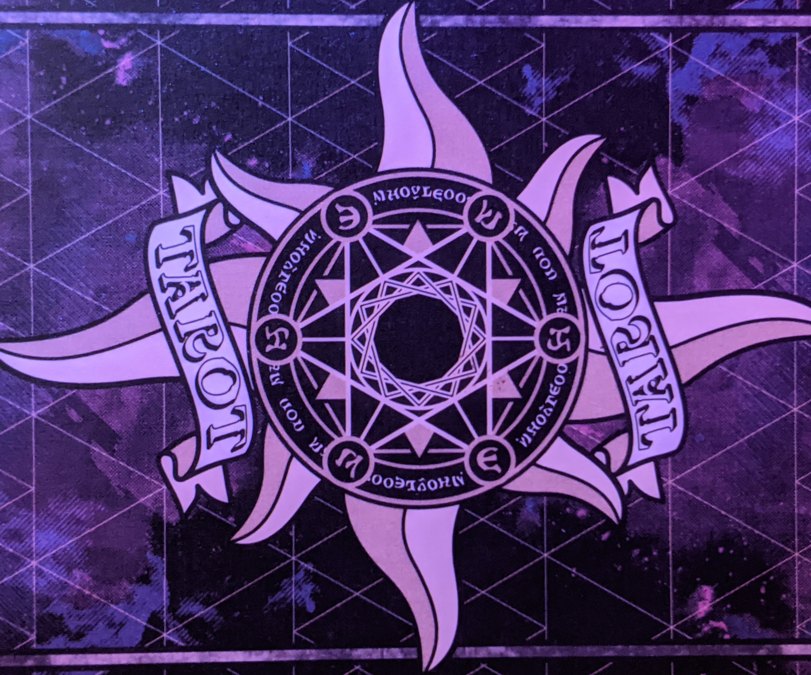
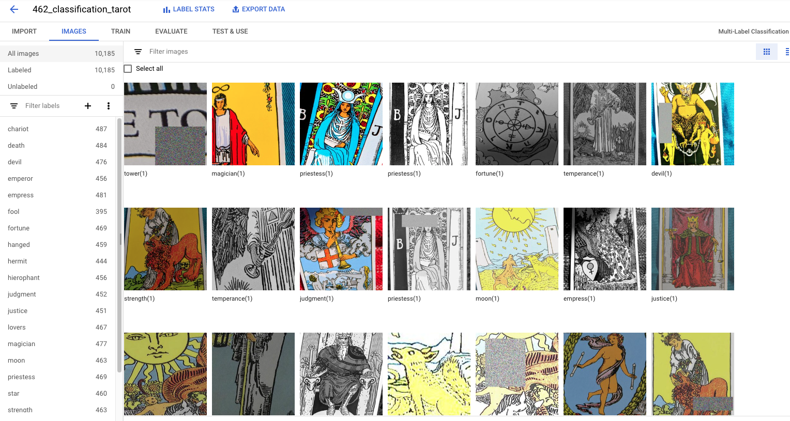
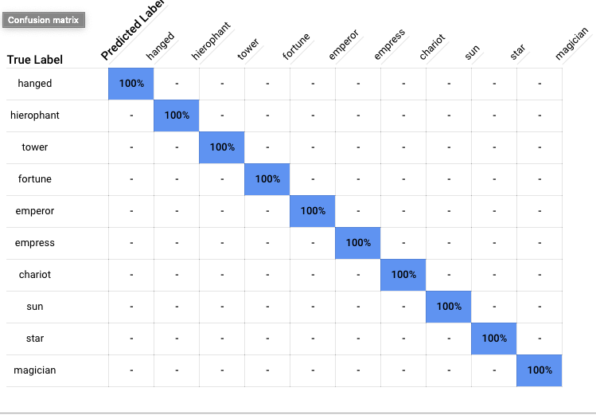
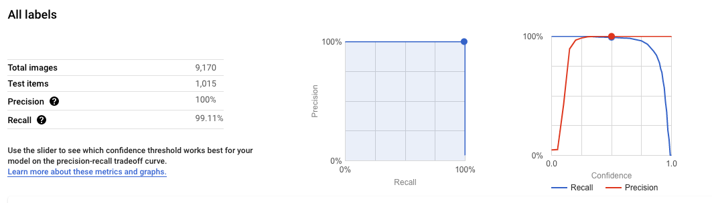

<!-- HEADER -->

  <h1 align="center">TarotBot-MLKit</h1>
  

     Final project for Northwestern University MSDS 462 - Computer Vision
  

***
## Table of Contents
* [Overview](#Overview)
* [Developing the dataset](#Dataset)
* [Model training with AutoML](#AutoML)
* [ML-Kit Demo App](#ML-Kit)
* [App Usage](#usage)

***
## Overview
This project is a combination of object detection and image classification on an Android edge device. In short, users can take a photo of a Tarot spread and the app will detect and classify up to 5 individual cards.

#### Tools Used
* The awesome [Augmentor](https://augmentor.readthedocs.io/en/master/) Python package helped a ton with expanding the training dataset.
* [Google AutoML Vision](https://cloud.google.com/vision) was used to train and test the model.
* A [Tensorflow Lite](https://www.tensorflow.org/lite/) multi-class classification model for edge device deployment.
* The app itself is modified from [Google's ML-Kit](https://developers.google.com/ml-kit/guides) demo app.

## Dataset
The dataset is custom. While many different Tarot decks exist, by far the most popular is the [Rider-Waite-Smith deck](https://en.wikipedia.org/wiki/Rider-Waite_tarot_deck), so I opted to go with that. I used a Google Pixel 3a to photograph the cards.

#### Class Selection
Standard Tarot sets have 78 cards, each of which has a different interpretation when displayed right-side up or upside-down.
Unfortunately, developing a dataset with and training a custom object detection model on 158 classes was a monster task, so I opted to focus solely on the [22 major arcana](./assets/training_data). Hopefully this can be extended in the future to include the whole enchilada!

#### Image Augmentation
This task lent itself well to image augmentation. The majority of variability within each class is likely to come from different camera sensors, lighting, or photo angle (as opposed to natural variability within the class). I used the awesome Augmentor Python package to augment the size of the training dataset enormously.

## AutoML
I used Google's AutoML Vision service to train and evaluate the models. It's an awesome service that makes machine learning model building so straightforward. It was a simple matter of uploading the photos to a Google Cloud storage bucket, [generating a CSV](./assets/training_data/gcp_automl_training_csv.py) to direct the model to each photo, then choosing the model output type I desired.

#### Object Detection vs Mutli-Class Classification
Unfortunately, I wasted quite a bit of time (and GCP credit!) by first training an object detection model. Turns out that ML-Kit object detection has its own built-in object detector which relies on a user-supplied classification model to actually perform classification. In the end, I ended up training two models.

That said, the second multi-class classification model I trained ended up being quite a bit more accurate and less computationally expensive than the initial object detection model.

#### TFLite Output
To make the model compact and quick enough that an edge device could store and run it, Tensorflow Lite is the model type that ML-Kit is built to work with. Thankfully, I was able to simply download this model from AutoML instead of having to generate it myself with the notoriously difficult TOCO command line tool.

*If you want to visualize the architecture of [the Tarot-Bot TFLite model](./mlkit/app/src/main/assets/tarot-classify.tflite) (or any neural net model!), upload it on [Netron](https://netron.app/).*

## ML-Kit
Google's ML-Kit demo app made deployment of the model on an edge device pretty straightforward. The demo app has a **ton** of optional code to allow for demonstration of several different computer vision scenarios in both Java and Kotlin. However, getting a custom model deployed was a matter of editing a single file to add a custom detector option, then dropping the .tflite model into the [assets](./mlkit/app/src/main/assets) folder within the app directory.

*For those curious, I added lines 74 and 393-408 in the [StillImageActivity.java](./mlkit/app/src/main/java/com/google/mlkit/vision/demo/java/StillImageActivity.java) file according to the ML-Kit [object detection docs](https://developers.google.com/ml-kit/vision/object-detection/android) in order to implement my custom Tarot detector option. No, I am not very good with Java.*

## Usage

#### Instructions
1. Clone this repo.
2. Install Android Studio.
3. Open Android studio, choose the option to *Open an Existing Project*. Select the `mlkit` folder within the repo. Approve any Gradle or APK updates.
4. Once Gradle finishes syncing, click the green play button on the top right to run the app on an Android emulator.
5. Upload photos to the downloads folder of the emulator (there are already a few in `assets/test_photos` within this repo).
6. Launch the MLKit App, choose  *Run the ML Kit quickstart written in Java*, then *StillImageActivity*.
8. Select the *Custom Object Detection (Tarot)* from the bottom right menu, then select an image.

#### Performance
The system does a fairly good job of detecting objects and classifying cards, although its maximum of 5 objects leaves much to be desired in terms of reading an actual tarot spread.
#### Android Studio vs Android
When using the app via the Android emulator in Android Studio (shown below), the only way to get photos into the emulator is to drag and drop into the downloads folder. When running the app on an actual Android phone, it's possible to take a photo of a card spread using the device camera.
